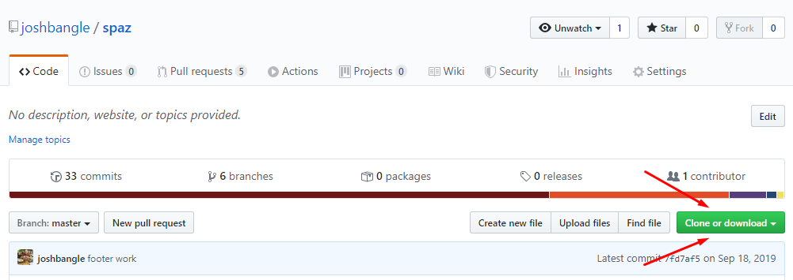

# Spaz

Video hosting website demo using AWS for video storage, Devise user authentication, and Stripe for secure payments

## Getting Started

### Prerequisites

In order to run this on your local setup, you will need:
- Git
- Ruby 2.5.3 or greater
- Rails 5.2.3 or greater

### Installing
- Clone the repository from the Github Page 
